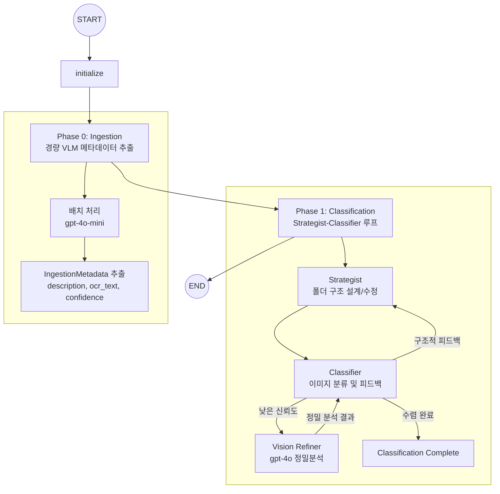

# 📸 Capture Insight

> 스크린샷 이미지를 자동으로 분류하고 정리하는 LangGraph 기반 멀티 에이전트 시스템
  
**Capture Insight**는 스크린샷을 자동으로 폴더 구조에 분류해 주는 멀티 에이전트입니다.  
- 경량 VLM으로 1차 메타데이터를 추출하고,   
- Strategist–Classifier 에이전트 상호작용을 통해 폴더 구조 생성과 분류를 수행하여  
- **비용과 정확도 사이의 균형**을 맞추도록 설계되었습니다.

---

## **데모 사이트**: [Streamlit 앱 링크](https://capture-insight-3o576qirzvpkwmimbv7vps.streamlit.app/)
- **예제 데이터**: `examples/screenshots/` 폴더에 17장의 예제 스크린샷이 내장되어 있습니다.
- **테스트 모드 (기본값)**: 사전 추출된 메타데이터를 사용해 빠르게 분류 과정을 체험할 수 있습니다.
- **풀 파이프라인 모드**: 사이드바에서 **"🔄 처음부터 VLM으로 분석 (Ingestion 실행)"** 을 체크하면, 실제 이미지를 VLM으로 처음부터 분석하는 전체 워크플로우가 실행됩니다.
- 📊 **LangSmith 트레이싱** : 
    - 분석 완료 후 앱 하단의 **"LangSmith 트레이스 보기 (공개 링크)"** 버튼을 클릭해보세요. 
    - Strategist와 Classifier가 어떻게 폴더 구조를 협의하고, Vision Refiner가 언제 개입하는지를 한눈에 추적할 수 있습니다.
    - [Capture Insight 트레이싱 예시 링크](https://smith.langchain.com/public/4ad43967-969e-4dc5-87eb-4b2b3c184933/r) 
---

## 🏗 시스템 아키텍처

### 1. 전체 워크플로우



### 2. 핵심 설계 특징

- **선형 파이프라인 → 자율 에이전트 루프**
  - 고정된 3단계 워크플로우 대신, Strategist–Classifier가 상황에 따라 상호작용하며 폴더 구조를 조정.
- **2단계 분석으로 비용 최적화**
  - Phase 0: `gpt-4o-mini`로 텍스트 메타데이터 추출  
  - Phase 1: 신뢰도가 낮거나 애매한 경우에만 `gpt-4o` Vision Refiner 호출
- **에이전트 안정성 장치**
  - 최대 반복 횟수 제한, 폴더 구조 변화가 없을 때 자동 종료(Convergence Check)

---

## 🚀 Quickstart (로컬 실행 - `uv` 기준)

### 1. 저장소 클론

```bash
git clone https://github.com/your-name/capture-insight.git
cd capture-insight
```

### 2. 환경 변수 설정

`env.example`를 `.env`로 복사한 뒤, 필수 키를 채워 넣습니다.

```bash
cp env.example .env
```

- **필수**
  - `OPENAI_API_KEY=sk-...`
- **선택 (있으면 LangSmith 트레이싱/공유 가능)**
  - `LANGSMITH_API_KEY=lsv2_...`
  - `LANGSMITH_PROJECT=capture-insight`
  - `LANGSMITH_TRACING=true`

### 3. 의존성 설치 (`uv`)

```bash
uv sync
```

Python 3.10 이상이 필요합니다. (`pyproject.toml`의 `requires-python = ">=3.10"`)

### 4. 웹앱 실행

```bash
uv run streamlit run app.py
```

기본 브라우저에서 Streamlit 앱이 열리며, 예제 스크린샷 목록을 확인하고 **"🚀 분석 시작"** 버튼으로 분류를 실행할 수 있습니다.

### 5. 내 스크린샷으로 전체 파이프라인 돌려보기

1. `examples/screenshots/` 폴더에 있는 예제 이미지를 지우거나 그대로 두고,  
   **분석해 보고 싶은 스크린샷 파일들을 이 폴더에 복사**합니다.
2. 브라우저에서 Streamlit 페이지를 새로고침하면, 업로드한 스크린샷 목록이 갱신됩니다.
3. 왼쪽 사이드바에서 **"🔄 처음부터 VLM으로 분석 (Ingestion 실행)"** 을 체크합니다.  
   - 기본값(체크 해제)은 사전 저장된 메타데이터를 사용하는 테스트 모드라,  
     내 스크린샷에는 메타데이터가 없어 전체 파이프라인이 돌지 않습니다.
4. 상단의 **"🚀 분석 시작"** 버튼을 눌러 전체 파이프라인(Ingestion → Strategist → Classifier → Vision Refiner)을 실행합니다.

---

## ⚙️ Configuration (설정 옵션)

### 1. 환경 변수 (`.env`)

`env.example`를 기준으로 주요 옵션은 다음과 같습니다.

- **API 키**
  - `OPENAI_API_KEY` (필수): OpenAI GPT-4o / 4o-mini 사용을 위한 API 키
  - `LANGSMITH_API_KEY` (선택): LangSmith 트레이싱 및 공유용
  - `LANGSMITH_PROJECT` (선택): LangSmith 프로젝트 이름 (기본값: `capture-insight`)
  - `LANGSMITH_TRACING` (선택): `"true"` 로 설정 시 트레이싱 활성화

- **모델 설정 (필요 시 오버라이드)**
  - `VISION_MODEL` (기본값: `gpt-4o`)
  - `ANALYSIS_MODEL` (기본값: `gpt-4o`)
  - `MAX_TOKENS` (기본값: `8192`)

> 참고: 일부 값은 `Configuration` 클래스에서 환경 변수로도 읽어옵니다. 숫자/실수 필드는 자동으로 캐스팅됩니다.

### 2. 런타임 설정 (`Configuration`)

`src/screenshot_analyzer/configuration.py`의 `Configuration` 모델을 통해 다음 옵션을 제어할 수 있습니다.

- **Ingestion (Phase 0)**
  - `ingestion_model` (기본값: `gpt-4o-mini`): 경량 Vision 모델
  - `refinement_threshold` (기본값: `0.6`): 이 신뢰도 미만일 때 Vision Refiner 호출
  - `ingestion_concurrency` (기본값: `3`): Ingestion 동시 처리 개수
  - `refinement_concurrency` (기본값: `2`): Vision Refiner 동시 처리 개수

- **에이전트/토큰 관련**
  - `vision_model` (기본값: `gpt-4o`)
  - `analysis_model` (기본값: `gpt-4o`)
  - `max_tokens` (기본값: `8192`)
  - `max_analysis_iterations` (기본값: `10`): Strategist–Classifier 루프 최대 반복 횟수
  - `max_structured_output_retries` (기본값: `3`): 구조화 응답 실패 시 재시도 횟수
---

## 🛠 Tech Stack (기술 스택)

| 기술 | 버전 | 용도 |
| --- | --- | --- |
| **LangGraph** | 0.2.x | 멀티 에이전트 워크플로우 오케스트레이션 |
| **LangChain / LangChain OpenAI** | 0.3.x / 0.2.x | LLM 호출 및 툴 연동 |
| **OpenAI GPT-4o / 4o-mini** | latest | Vision/텍스트 분석 (정밀/경량) |
| **Pydantic v2** | latest | 타입 안전한 State 및 툴 스키마 정의 |
| **Streamlit** | latest | 웹 UI |
| **LangSmith** | latest | 에이전트 실행 트레이싱 및 디버깅 |

---

## 📚 Learn More

- **포트폴리오 / 설계 스토리**  
  - https://drive.google.com/file/d/1AmmVhXYxPF38rthLBKgO95YjA12dCGOL/view?usp=sharing
  - 초기 선형 워크플로우 구조 → 자율 에이전트 전환, 권한 설계, Self-Healing 등 
  개발 과정에서 마주한 기술적 도전과 해결 방법을 정리했습니다.
