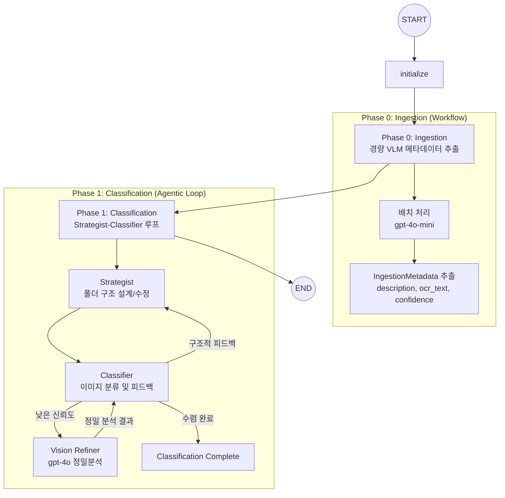

# 📸 Capture Insight

> 스크린샷 이미지를 자동으로 분류하고 정리하는 멀티 에이전트 시스템 

**Capture Insight**는 LangGraph 기반의 멀티 에이전트 시스템으로 스크린샷을 자동 분류하는 AI 솔루션입니다.  
비용 최적화와 분류 정확도 사이의 균형을 에이전틱 디자인 패턴으로 해결했으며, Workflow와 Agent를 조합하여 안정성과 유연성을 확보하고자 했습니다. 

---

🔗 **배포 URL**: [Streamlit 앱 링크](https://capture-insight-3o576qirzvpkwmimbv7vps.streamlit.app/)  

▶️ **사용 방법**: API 비용 절감을 위해 1차 이미지 분석 과정(ingestion)을 이전 분석 데이터로 고정하여 제공하는 "테스트 모드"를 디폴트로 제공합니다. 왼쪽 사이드바를 열어 "처음부터 VLM으로 분석하기"를 선택하면 전체 파이프라인을 실행할 수 있습니다.  
📊 **LangSmith 트레이스**: 실행 후 공개 링크를 클릭하면 LangSmith 트레이스를 확인할 수 있습니다. 

---

## 🏗 아키텍처 (System Architecture)

### 1. 전체 워크플로우


---

## 🔄 설계 진화 과정 (Evolution)

1차 과제: 선형 워크플로우 기반 시스템 → 2차 과제: 자율 에이전트 시스템

### Before: 선형 워크플로우 구조
**고정된 3단계 파이프라인**
1. `ConductVisionAnalysis`: 이미지 Vision 분석
2. `ConductClassification`: 분류 수행 지시
3. `ConductCategoryMerge`: 분류 및 병합 실행

**특징**
- 모든 스크린샷을 매번 고성능 VLM으로 분석
- 미리 정해진 순서대로만 실행되는 선형 구조
- 각 단계가 독립적으로 실행되어 전체 맥락 공유 어려움
- 보고서 생성과 같은 불필요한 부가 기능 포함

### After: 자율 에이전트 시스템
**에이전트 주도의 4단계 구조**
1. **Ingestion** (Workflow): 경량 VLM으로 텍스트 메타데이터 선추출
2. **Strategist** (Agent): 전체 상황을 파악하고 최적의 폴더 구조 설계
3. **Classifier** (Agent): 설계된 전략에 따라 파일 배정 
4. **Vision Refiner** (Agent): 필요시에만 고성능 VLM으로 정밀 분석

**핵심 변화**
- **선형 → 자율**: 고정된 파이프라인에서 에이전트가 상황에 따라 판단하는 구조로 전환
- **에이전트 협업**: 별도 `ConductCategoryMerge` 삭제, Strategist와 Classifier가 반복적으로 상호작용하며 폴더 구조를 개선 (단일 실행 → 협업 루프)
- **선택적 실행**: 모든 이미지를 분석하는 대신, 필요한 경우에만 Vision Refiner 호출
- **목적 집중**: 보고서/웹 검색 제거, 스크린샷 분류 기능에만 집중

### 개선 효과
- 선형 워크플로우의 경직성 탈피, 상황에 맞는 유연한 처리 가능
- 고성능 VLM 호출 횟수 대폭 감소로 API 비용 절감
- 에이전트가 전체 맥락을 이해하고 전략 수립
- 디버깅 및 유지보수 용이

---

## 💡 핵심 설계 결정 (Design Decisions)

리팩토링 과정에서 내린 주요 설계 결정들입니다.

### 1. Workflow와 Agent의 역할 분리

**문제점**
- 선형 워크플로우는 안정적이지만 유연성이 부족
- 모든 과정을 에이전트에게 맡기면 실행 경로가 불안정하고 비용 예측이 어려움

**해결 방법**
- 반복적인 데이터 처리(스크린샷 메타데이터 추출)는 **Workflow(Ingestion)**로 안정적으로 실행
- 분류 전략 수정 같은 고차원 판단은 **Agent(Strategist, Classifier)**가 자율적으로 수행

**결론**: 안정성이 필요한 부분은 워크플로우로, 유연한 판단이 필요한 부분은 에이전트로 분리

### 2. 2단계 분석을 통한 비용 최적화 (Selective Refinement)

**문제점**
- 모든 스크린샷을 고성능 VLM(GPT-4o)으로 분석하면 API 비용이 과도하게 발생

**해결 방법**
- **Phase 0 (Ingestion)**: 경량 모델(`gpt-4o-mini`)로 텍스트 메타데이터 추출
- **Phase 1 (Vision Refiner)**: 1차 추출한 텍스트만으로 판단 어려운 경우에만 고성능 VLM 호출하여 추가적인 맥락 파악 

**효과**: 분류 품질 유지하면서 고성능 VLM 호출 비용 절감

### 3. 에이전트 안정성 장치 (Guardrails)

**문제점**
- 자율 루프가 무한 반복되거나 불필요한 비용을 소진할 위험

**해결 방법**
- **Iteration Limit**: 최대 재설계 횟수 제한
- **Convergence Check**: 폴더 구조 변경이 없으면 자동 종료

**결론**: 에이전트 자율성에는 반드시 명확한 종료 조건이 필요

---

## 🚀 멀티 에이전트 설계 원칙

실제 구현 과정에서 발생한 문제들을 해결하며 확립한 설계 원칙들입니다.

### 관심사의 분리 (Separation of Concerns)
각 에이전트는 단일 책임만 수행하도록 설계:
- **VLM (Ingestion)**: 시각적 정보 추출만 담당
- **Strategist**: 폴더 구조 설계
- **Classifier**: 파일 배정
- **Vision Refiner**: 선택적 정밀 분석

이를 통해 판단 편향을 줄이고 각 단계의 품질을 독립적으로 개선 가능

### 권한 위계와 판단 격리 (Authority Hierarchy)
**원칙**
- 하위 에이전트의 제안이 상위 에이전트의 결정권을 침해하지 않도록 설계

**문제 상황**
- Vision Refiner 과정에서 VLM이 추천 폴더명을 직접 제공했을 때, Classifier가 Strategist의 구조를 무시하고 VLM 제안을 맹신

**해결**
- VLM 출력에서 '추천 폴더' 필드 삭제, '객관적 묘사'만 전달
- 최종 판단은 Classifier가 Strategist의 가이드 하에서만 수행하도록 권한 격리

### 피드백 기반 협업 루프 (Feedback Loop)
**원칙**
- 에이전트 간 상호작용은 단방향이 아닌 양방향 피드백 루프로 구성

**구현**
- Classifier가 분류 중 모호함을 느끼면 `ReportAmbiguity`로 Strategist에게 구조 변경 역제안
- Strategist는 피드백을 수용하거나 원칙에 따라 기각하며 구조 확정
- 상호작용을 통해 시스템이 스스로 구조적 결함을 개선

### Self-Healing 메커니즘
**원칙**
- LLM이 잘못된 형식을 반환해도 시스템을 중단하지 않고 자가 수정 기회 제공

**구현**
- Pydantic으로 응답 형식 검증 (예: Dictionary 대신 List 반환 감지)
- ValidationError 발생 시, 에러 메시지를 프롬프트에 포함하여 LLM에게 재전달
- 코드 레벨의 타입 체크와 프롬프트 레벨의 피드백("동료 설계 무시 행위") 결합

**효과**
- 시스템 회복 탄력성 증가, 예외 상황에서도 안정적 실행

---

## 🛠 기술 스택

| 기술 | 버전 | 용도 |
| --- | --- | --- |
| **LangGraph** | 0.2.x | 멀티 에이전트 워크플로우 오케스트레이션 |
| **OpenAI GPT-4o / mini** | latest | Vision API 기반 이미지 분석 (정밀/경량) |
| **Pydantic** | v2 | 타입 안전한 State 및 도구 스키마 정의 |
| **Streamlit** | latest | 직관적인 웹 인터페이스 제공 |
| **LangSmith** | latest | 에이전트 실행 과정 트레이싱 및 디버깅 |

---

## 📂 프로젝트 구조
```text
src/screenshot_analyzer/
├── analyzer.py       # 메인 그래프 및 서브그래프 정의 (Logic)
├── state.py          # IngestionMetadata, RefinementResult 등 State 정의
├── prompts.py        # 에이전트별 페르소나 및 시스템 프롬프트
└── utils.py          # Vision API 호출 및 이미지 전처리 유틸
```
