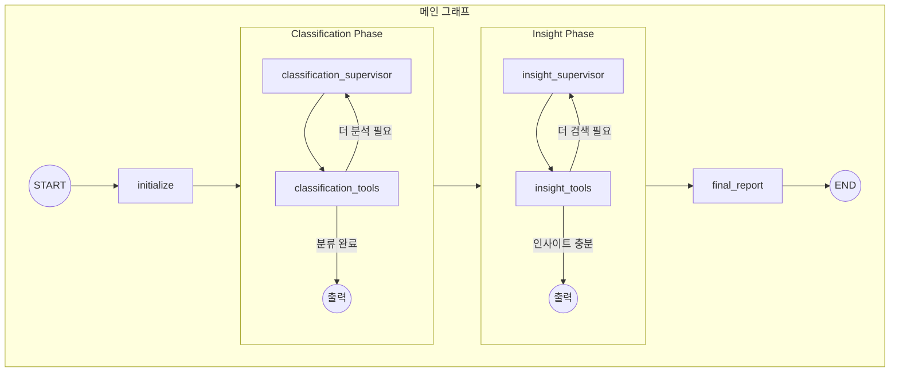

# 📸 Capture Insight

> 스크린샷을 자동으로 분류하고 인사이트를 제공하는 AI 에이전트

LangGraph 기반의 멀티 에이전트 시스템으로, 스크린샷 이미지를 분석하여 카테고리를 자동 분류하고, 웹 검색을 통해 카테고리별 인사이트를 수집한 뒤 종합 보고서를 생성합니다.

---

## 🎯 프로젝트 목표

### 해결하고자 하는 문제
스마트폰에 쌓여있는 수많은 스크린샷들을 자동으로 정리하고, 각 카테고리에 대한 유용한 정보를 제공받고 싶었습니다.

### 왜 LangGraph인가?
- **복잡한 워크플로우**: 이미지 분석 → 분류 → 검색 → 보고서 생성의 다단계 파이프라인
- **Agentic 설계**: LLM이 스스로 판단하여 재분석/재검색 등을 결정하는 자율적 에이전트 구현
- **상태 관리**: 각 단계의 결과를 체계적으로 관리하고 다음 단계로 전달

---

## 🛠 기술 스택

| 기술 | 용도 |
|------|------|
| **LangGraph** | 멀티 에이전트 워크플로우 오케스트레이션 |
| **OpenAI GPT-4o** | Vision API 기반 이미지 분석 및 OCR |
| **Tavily** | 실시간 웹 검색 |
| **Pydantic** | 타입 안전한 State 및 도구 스키마 정의 |

---

## 🏗 아키텍처

### 전체 그래프 구조



---

## 💭 설계 고민 과정

### 1. State 설계: 통합 vs 분리

**초기 접근**: 하나의 통합 State로 모든 데이터 관리

```python
# ❌ 초기 설계 (통합)
class ScreenshotAnalyzerState(TypedDict):
    images: list[str]
    vision_results: dict
    classifications: dict
    category_insights: dict
    final_report: str
    # ... 모든 필드가 한 곳에
```

**문제점**: 
- Classification과 Insight는 완전히 다른 작업인데 같은 State를 공유
- 각 Phase의 내부 상태(반복 횟수, 진행 상황)를 관리하기 어려움
- 서브그래프 간 결합도가 높아짐

**최종 설계**: Phase별 독립 State + 메인 State

```python
# ✅ 최종 설계 (분리)
class ScreenshotAnalyzerState(MessagesState):
    """메인 그래프 상태 - Phase 간 데이터 전달"""
    images: list[str]
    classifications: Annotated[dict, override_reducer]
    category_insights: Annotated[dict, override_reducer]
    final_report: str

class ClassificationState(MessagesState):
    """Classification 서브그래프 전용 상태"""
    images: list[str]
    analyzed_images: list[str]  # Phase 내부 진행 상황
    iteration_count: int        # Agentic 루프 카운터
    vision_results: dict
    classifications: dict

class InsightState(MessagesState):
    """Insight 서브그래프 전용 상태"""
    categories: list[str]
    searched_categories: list[str]  # Phase 내부 진행 상황
    iteration_count: int            # Agentic 루프 카운터
    category_insights: dict
```

**결정 이유**: 
- 각 Phase가 독립적인 책임을 가짐
- Phase 내부의 Agentic 루프를 깔끔하게 관리 가능
- LangGraph의 서브그래프 패턴과 자연스럽게 연결

---

### 2. 그래프 구조: 복잡한 서브그래프 vs 단순 선형

**고민**: open_deep_research처럼 복잡한 구조를 그대로 따라할 것인가?

| 비교 | open_deep_research | 본 프로젝트 |
|------|-------------------|-------------|
| **목적** | 다양한 질문에 동적 대응 | 고정된 워크플로우 (분류 → 인사이트) |
| **작업 특성** | 매번 다른 리서치 경로 | 동일한 파이프라인 반복 |
| **복잡도** | 높음 (Human-in-the-loop 등) | 중간 |

**결정**: 
- 메인 플로우는 **선형** (Classification → Insight → Report)
- 각 Phase 내부는 **Agentic** (supervisor ↔ tools 루프)

**이유**: 
- 우리 워크플로우는 "분류 → 인사이트 → 보고서"로 고정됨
- 하지만 각 Phase 내부에서는 LLM이 자율적으로 판단해야 함
  - "이 이미지 분류가 애매한데 다시 분석할까?"
  - "인사이트가 부족한데 다른 키워드로 검색할까?"

---

### 3. Agentic 설계: Supervisor 패턴

각 Phase 내부에서 **Supervisor가 판단하고 Tools가 실행**하는 구조를 채택했습니다.

```
┌─────────────────────────────────────────────┐
│           Classification Phase              │
│                                             │
│   Supervisor (LLM)                          │
│   "미분석 이미지가 3장 있네,                      │
│    Vision 분석을 먼저 하자"                     │
│         │                                   │
│         ▼ ConductVisionAnalysis             │
│   Tools (실행)                               │
│   - Vision API 호출                          │
│   - 결과 State에 저장                          │
│         │                                   │
│         ▼ (결과 반환)                         │
│   Supervisor (LLM)                          │
│   "분석 완료! 이제 분류하자"                      │
│         │                                   │
│         ▼ ConductClassification             │
│   Tools (실행)                               │
│   - 분류 수행                                 │
│         │                                   │
│         ▼ (결과 반환)                         │
│   Supervisor (LLM)                          │
│   "신뢰도가 높아. 완료!"                        │
│         │                                   │
│         ▼ ClassificationComplete            │
│                                             │
└─────────────────────────────────────────────┘
```

**Supervisor가 사용하는 도구들**:

| Phase | 도구 | 설명 |
|-------|------|------|
| Classification | `ConductVisionAnalysis` | 이미지 Vision 분석 지시 |
| Classification | `ConductClassification` | 분류 수행 지시 |
| Classification | `ClassificationComplete` | Phase 완료 선언 |
| Insight | `ConductSearch` | 웹 검색 지시 |
| Insight | `InsightComplete` | Phase 완료 선언 |

---

## 📁 프로젝트 구조

```
capture-insight/
├── src/screenshot_analyzer/
│   ├── analyzer.py       # 메인 그래프 및 서브그래프 정의
│   ├── state.py          # State 및 도구 스키마 정의
│   ├── prompts.py        # LLM 프롬프트 템플릿
│   ├── configuration.py  # 설정 관리
│   └── utils.py          # Vision API, Tavily 검색 유틸
├── langgraph.json        # LangGraph 설정
├── pyproject.toml        # 의존성 관리 (uv)
└── env.example           # 환경 변수 템플릿
```

---

## 🚀 설치 및 실행

### 1. 의존성 설치

```bash
# uv 설치 (없는 경우)
curl -LsSf https://astral.sh/uv/install.sh | sh

# 의존성 설치
uv sync
```

### 2. 환경 변수 설정

```bash
cp env.example .env
```

```env
# .env
OPENAI_API_KEY=sk-your-openai-api-key
TAVILY_API_KEY=tvly-your-tavily-api-key
```

### 3. 실행

```bash
# LangGraph Studio에서 실행
uv run langgraph dev
```
